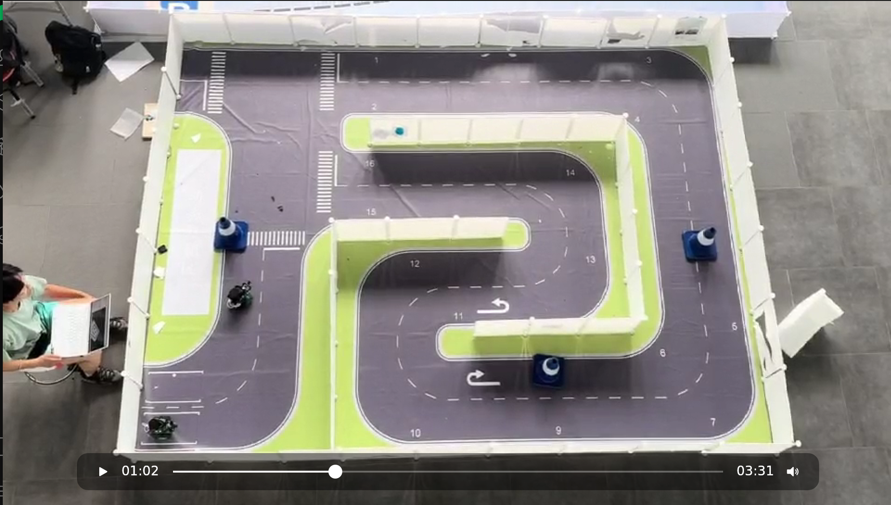
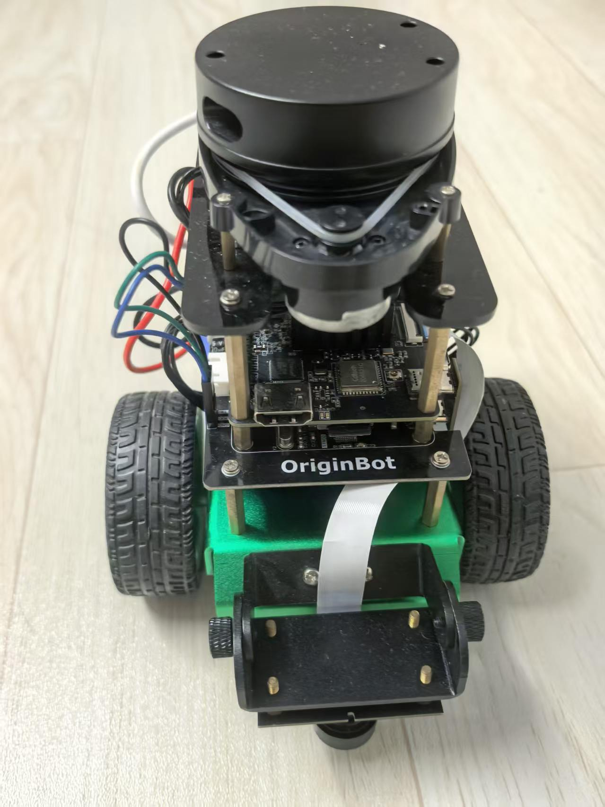
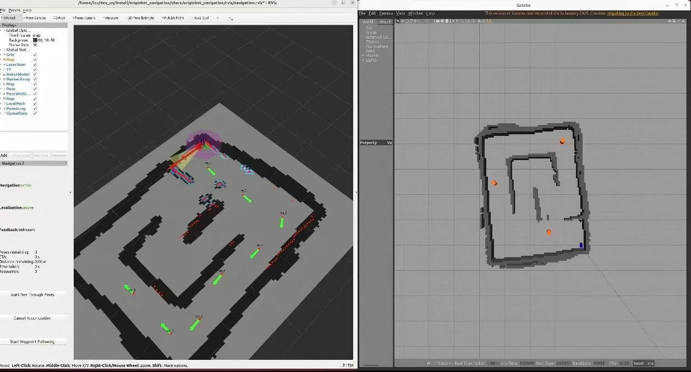
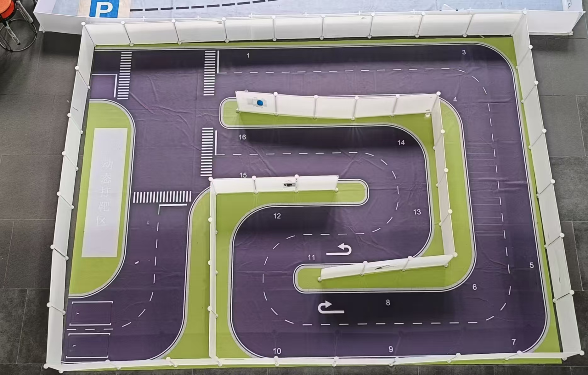
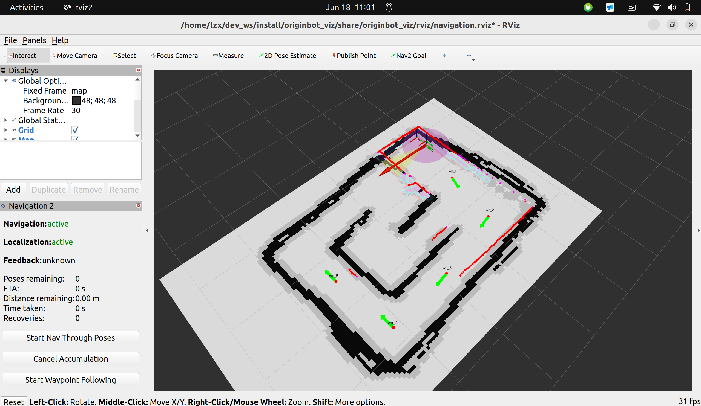
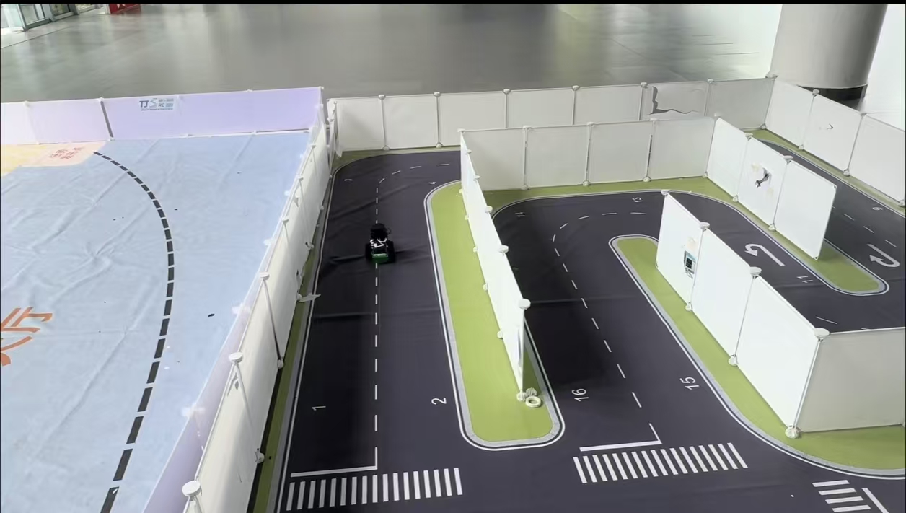
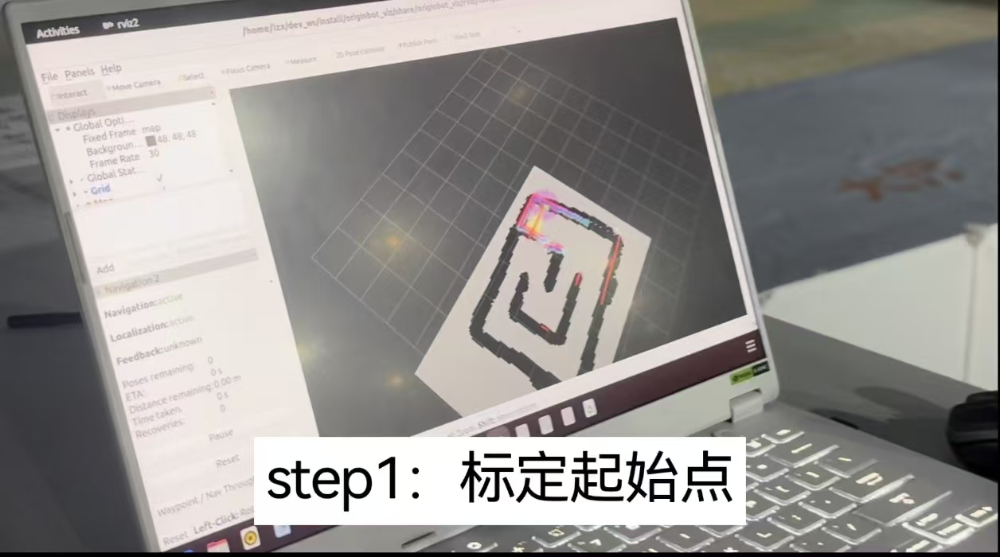

# OriginBot 室内避障与多点导航

基于 ROS 2 Humble、Nav2、Gazebo 和 RViz 的 OriginBot 导航实践项目。
本项目包含自定义室内地图与仿真场景、导航参数调优、激光雷达建图配置，
以及 RViz waypoint 交互界面。

## 演示视频

[](https://laurellang.github.io/originbot_desktop/demo.html)

**[在线播放完整演示视频](https://laurellang.github.io/originbot_desktop/demo.html)**
· [下载 MP4 原文件（34.8 MB）](docs/media/originbot-demo.mp4)

> 点击上面的视频封面即可打开网页播放器，无需使用 GitHub 的大文件预览。

## 项目功能

- 在 Gazebo 中加载自定义地图、墙体和避障测试场景。
- 使用激光雷达与 Cartographer 完成环境建图。
- 使用 Nav2 进行全局路径规划、局部避障和目标跟踪。
- 使用 Regulated Pure Pursuit Controller 控制差速小车运动。
- 在 RViz 中使用 Navigation 2 面板和 GoalTool 设置导航目标。
- 显示 waypoint 的位置、编号和朝向，支持多目标点导航工作流。
- 支持仿真环境和真实 OriginBot 小车实验。

## 项目展示

| OriginBot 小车 | Gazebo 仿真 |
| --- | --- |
|  |  |

| 实景地图 | 雷达扫描地形图 |
| --- | --- |
|  |  |

| 实景寻径 | 实景操作 |
| --- | --- |
|  |  |

更多图片：[小车侧面](docs/photos/originbot-2.jpg) ·
[实景操作视角 2](docs/photos/real-world-operation-2.jpg)

## 课程报告

完整的项目背景、系统方案、算法流程、调试记录和实验总结见：

**[下载 OriginBot 课程报告（DOCX）](docs/reports/originbot-course-report.docx)**

## 主要改动

- `originbot_gazebo/worlds/my_map.world`：自定义 Gazebo 场景。
- `originbot_navigation/maps/my_map.*`：实验环境栅格地图。
- `originbot_navigation/param/originbot_nav2.yaml`：Nav2 控制器、代价地图和避障参数。
- `originbot_navigation/launch/`：自定义地图、参数文件和 RViz 配置入口。
- `originbot_navigation/rviz/navigation.rviz`：Navigation 2 面板、GoalTool 和 waypoint 显示。

## 环境

- Ubuntu 22.04
- ROS 2 Humble
- Nav2
- Gazebo Classic
- Cartographer
- RViz 2

## 构建

```bash
mkdir -p ~/dev_ws/src
cd ~/dev_ws/src
git clone https://github.com/laurellang/originbot_desktop.git

cd ~/dev_ws
source /opt/ros/humble/setup.bash
colcon build --packages-select \
  originbot_gazebo originbot_navigation originbot_viz \
  --symlink-install
source install/setup.bash
```

## 运行仿真导航

```bash
ros2 launch originbot_gazebo originbot_navigation_gazebo.launch.py
```

也可以覆盖默认 world 和地图：

```bash
ros2 launch originbot_gazebo originbot_navigation_gazebo.launch.py \
  world:=/path/to/world.world \
  map:=/path/to/map.yaml
```

## 仓库范围

本仓库包含 PC 端与 Gazebo 仿真侧代码。部署在真实小车
`/userdata/dev_ws` 下的自定义 waypoint sender 暂未包含在本仓库中。

本项目基于 [guyuehome/originbot_desktop](https://github.com/guyuehome/originbot_desktop)
进行开发，沿用原项目的 [Apache License 2.0](LICENSE)。
